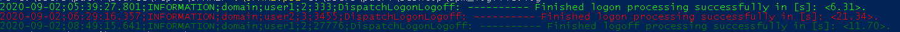

# User Profile Management Key Indicators (UPMKI)

The UPMKI is a tool to read a Citrix UPM logfile and outputs the login/logoff times.

## Requirements

* PowerShell

## Usage

The simplest way to use the script:
> & '.\UPMKI.ps1' -UPMLogfile upm.log

You'll see something like this:  

Another way to use the tool is to define the optional parameter for the login/logoff thresholds.
> & '.\UPMKI.ps1' -UPMLogfile upm.log -ThresholdLogin 15 -ThresholdLogin 15

The default threshold is 20.

## Troubleshooting

I use `Write-Debug` to print verbose information about the processed data.  
You can enable the debug output with `$DebugPreference = 'Continue'`.  
You can disable the debug output with `$DebugPreference = 'SilentlyContinue'`.

## Issues / Questions / Suggestions for improvement

Please create an issue. I'll love to hear feedback.
